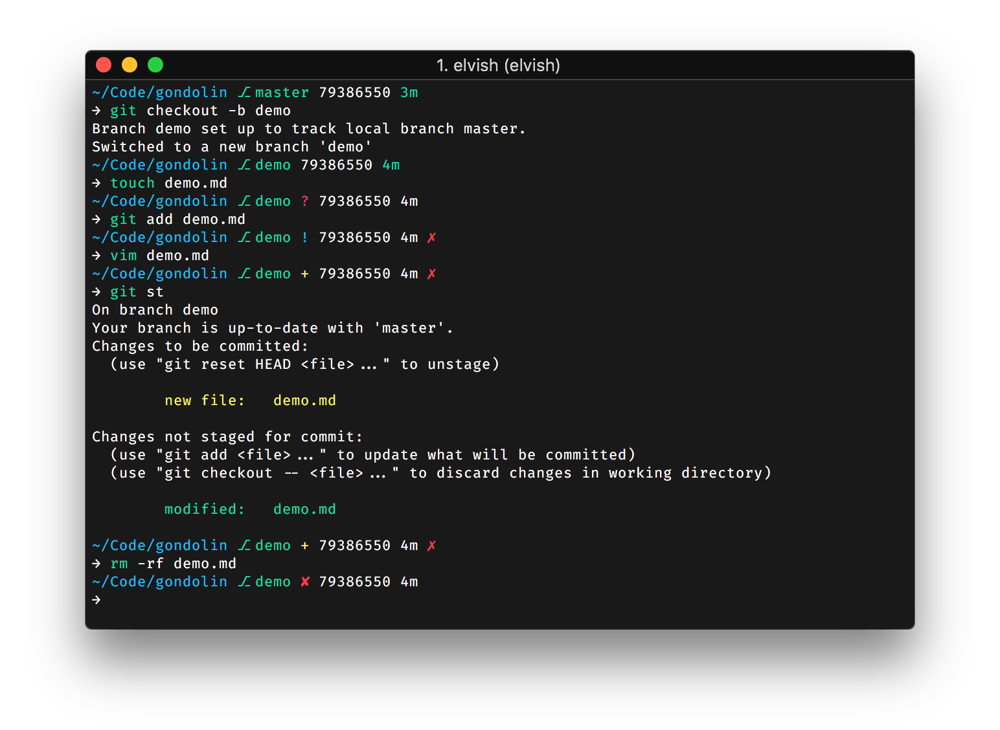

# Gondolin 
A delightfully-opinionated [Elvish](https://elv.sh) configuration.



Currently it shows:
* Current working directory
* Current Git branch and rich repo status in prompt readline. 
  * `?` — untracked changes;
  * `+` — uncommitted changes in the index;
  * `!` — unstaged changes;
  * `»` — renamed files;
  * `✘` — deleted files;
  * `$` — stashed changes [WIP];
  * `§` — unmerged changes;
  * `⇡` — ahead of remote branch;
  * `⇣` — behind of remote branch;
  * `⇕` — diverged changes.
* Current Git SHA
* Colorized time since last commit
* A red marker (`✗`) if last command exits with non-zero code.

## Installation
### Prerequisites 
_**Disclaimer:** Gondolin will work best on macOS and Linux._
  - Unix-like operating system
  - Elvish should be installed (v0.11 or newer, use `elvish --buildinfo` to confirm version). 
    - If Elvish is not installed, refer to the [installation guide](https://elv.sh/download/).
  - `git` should be installed

### Basic Installation
Gondolin can be installed and configured using the [Elvish Package Manager](https://elv.sh/ref/epm.html) (`epm`)
```sh
use epm

epm:install github.com/tylerreckart/gondolin

use github.com/tylerreckart/gondolin/gondolin
```
